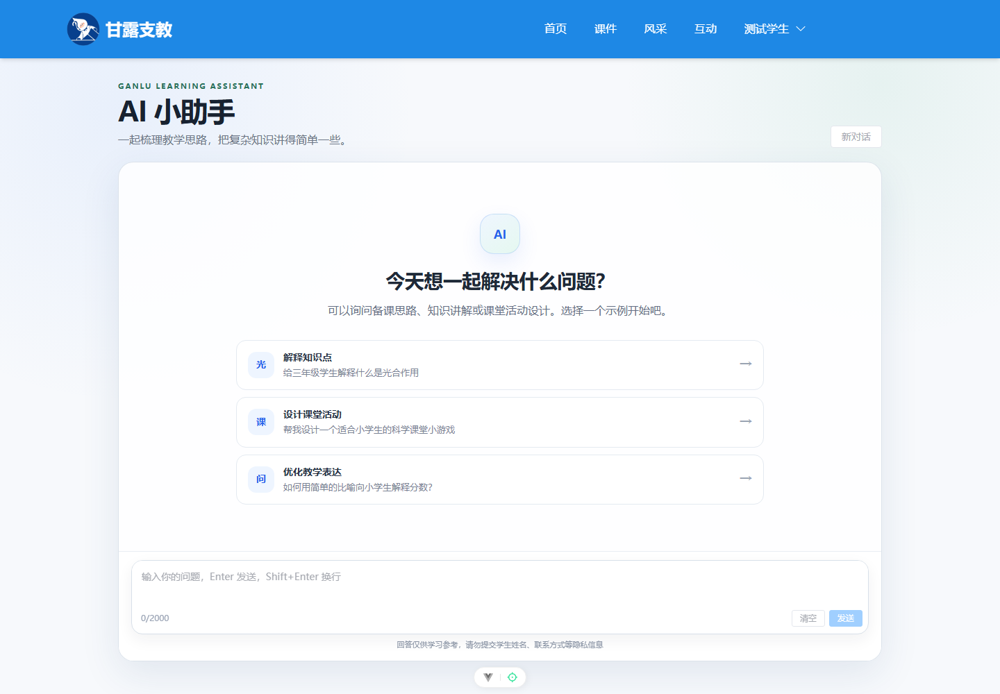
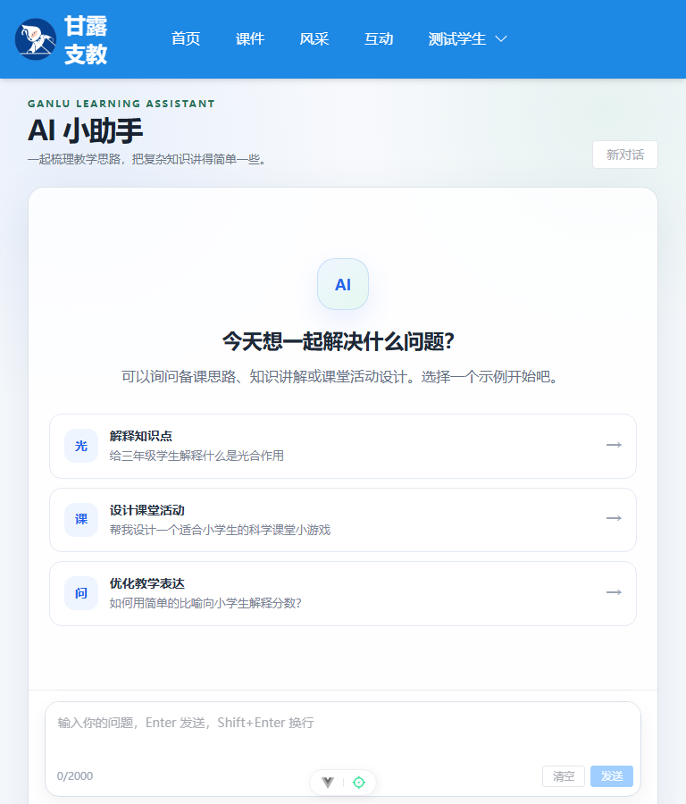
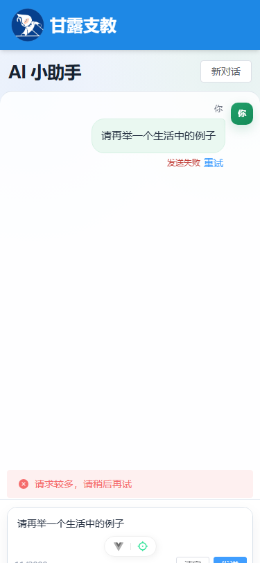

# AI 小助手前端集成说明

## 交付范围

乔轩轲负责的前端模块已按 `POST /ai/chat` 非流式接口实现，包含：

- AI 对话整页容器、欢迎示例、消息气泡和输入组件；
- 最近 20 条消息的多轮会话；
- 1～2000 字输入校验、重复发送拦截和请求取消；
- 失败保留、原消息重试、清空二次确认；
- 400、401、429、502、503、504、超时、断网提示；
- 登录引导、移动端适配和 `sessionStorage` 会话保存。

前端只请求本站后端，不包含 DeepSeek 地址、模型名、用户 ID、权限等级或 API Key。

## 需要赵友为合并的共享文件

本分支没有修改共享的路由、导航、路径或 HTTP 实例。总集成时请完成以下两处修改。

### 1. 添加懒加载路由

在 `frontend/src/router/index.js` 的 `routes` 数组中加入：

```js
{
  path: '/ai',
  name: 'ai-assistant',
  component: () => import('@/views/AiAssistant.vue'),
  meta: {
    layout: 'DefaultLayout',
    hideBanner: true,
    requiresAuth: true,
    roles: [0, 1, 2],
  },
},
```

该路由沿用现有全局守卫：未登录时跳转 `/login`，管理员、团队账号和学生账号均可访问。

### 2. 添加导航入口

在 `frontend/src/components/Top.vue` 的公开导航区域中，建议放在“互动”之后：

```vue
<el-menu-item v-if="userInfo.isLoggedIn" index="/ai">AI 助手</el-menu-item>
```

如产品希望游客也能看到入口，可以去掉 `v-if`；页面自身会显示登录引导，路由守卫仍会强制登录。

`frontend/src/utils/path.js` 无需修改，AI 请求路径由独立的 `apis/aiAPI.js` 封装。

## 接口字段

请求：

```http
POST /ai/chat
Authorization: Bearer <token>
Content-Type: application/json
```

```json
{
  "messages": [
    { "role": "user", "content": "给三年级学生解释什么是光合作用" },
    { "role": "assistant", "content": "……" },
    { "role": "user", "content": "再举一个生活中的例子" }
  ]
}
```

前端只读取成功响应中的 `content.answer`，可选保存 `content.requestId` 用于当前内存中的问题定位，但不会将其发送给后端。

## 状态码展示

| HTTP 状态 | 前端提示/处理 |
|---|---|
| 400 | 输入内容不符合要求，请检查后重试 |
| 401 | 登录状态已失效，请重新登录；现有全局拦截器会清除登录状态并跳转登录页 |
| 429 | 请求较多，请稍后再试 |
| 502 / 503 / 504 | AI 服务暂时不可用 |
| Axios 超时 | AI 服务响应超时，请稍后重试 |
| 断网或无响应 | 网络连接失败，请检查网络后重试 |
| 主动停止 | 保留用户消息，显示“已停止生成”，允许重试 |

## 会话和隐私

- Pinia Store 最多保存当前会话最近 20 条用户/助手消息；历史按完整问答轮次裁剪，不会以孤立的助手回复开头。
- 必要消息仅写入当前标签页的 `sessionStorage`，键名为 `ganlu-ai-session-v1`，并记录所属登录身份。
- 登录身份变化或退出登录时立即中止未完成请求，同时清空消息、输入草稿、错误状态和会话存储，避免共享电脑换号时泄露上一账号的上下文。
- 没有为 AI Store 启用 Pinia `persist` 插件，不写入 `localStorage`。
- 新对话会二次确认并清除上述会话数据；关闭标签页后浏览器自动清除。
- 助手内容使用 Vue 文本插值和 `white-space: pre-wrap` 显示，没有使用 `v-html`。

## 页面截图

以下截图使用本地 Mock `/ai/chat` 和 Edge 无头浏览器生成，不调用真实 DeepSeek 服务。

### 桌面端欢迎页（1440px）



### 平板端欢迎页（768px）



### 移动端异常与重试状态（375px）



## 手工验收记录

| 编号 | 操作 | 预期结果 | 实际结果 |
|---|---|---|---|
| AI-FE-01 | 使用本地 Mock 连续发送 3 轮问题 | 每轮只产生一次请求，请求携带当前多轮上下文 | 通过；三次请求分别携带 1、3、5 条消息 |
| AI-FE-02 | 同步快速点击发送按钮两次 | 请求期间按钮禁用，只产生一次请求 | 通过；Mock 服务仅收到 1 次请求 |
| AI-FE-03 | 输入空白文本和 2001 字 | 空白不可发送；超长显示“最多输入 2000 字” | 通过；超长提示可见且发送按钮禁用 |
| AI-FE-04 | Mock 返回 HTTP 429 | 显示“请求较多，请稍后再试”并保留原问题 | 通过；错误提示、失败状态和重试入口均可见 |
| AI-FE-05 | 请求期间点击停止 | HTTP 请求被取消，用户消息保留并可重试 | 通过；页面显示“已停止生成”及重试按钮 |
| AI-FE-06 | 检查浏览器发出的 JSON | 每条消息只有 `role` 和 `content` | 通过；三轮请求字段检查结果均为 true |
| AI-FE-07 | 检查 400、401、502、503、504、超时和断网分支 | 提供稳定、明确的中文提示 | 通过代码路径检查；真实后端联调待后端环境就绪 |
| AI-FE-08 | 检查 375px、768px 和 1440px 截图 | 输入区不遮挡末条消息，长回复可滚动且不撑破页面 | 通过；见上方三张验收截图 |
| AI-FE-09 | 检查浏览器存储 | sessionStorage 保存当前会话；localStorage 无 AI 会话和密钥 | 通过；AI localStorage 键为 0，敏感值检查为 false |
| AI-FE-10 | 执行完整路由接入后的 `npm run build` | AI 页面被懒加载并成功生成独立 chunk | 通过；生成约 13 kB 的 AI 页面 JS chunk |
| AI-FE-11 | 同一标签页从账号 A 切换至账号 B | 立即清除账号 A 的消息；账号 B 请求不携带账号 A 上下文 | 通过；存储已清除，账号 B 首个请求仅 1 条且不含账号 A 内容 |
| AI-FE-12 | 请求仍在思考时确认清空 | 中止完成后消息、输入框、错误提示和 sessionStorage 均保持为空 | 通过；四项状态均为空，旧问题未异步恢复 |
| AI-FE-13 | 完成 10 轮后发送第 11 个问题 | 请求不超过 20 条、从 user 开始、历史问答成对，最后一条为本轮 user | 通过；请求为 19 条且角色严格交替，回答后存储为 20 条完整消息 |

验证环境：Windows 11、Node.js 24.18.0、npm 11.16.0、Microsoft Edge 无头模式。2026-08-01 按 PR #9 审核意见完成账号隔离、请求中清空和第 11 轮上下文专项回归。本地 Mock 不消耗真实 AI 额度。由于项目基线中的 `@videojs-player/vue@1.0.0` 与 `video.js@8` 存在 peer dependency 冲突，npm 11 安装时使用了 `npm ci --legacy-peer-deps --cache .npm`，未修改 `package.json` 或锁文件。

真实接口联调前需要：后端 AI 分支合入可运行环境、有效登录测试账号，以及由后端环境变量配置的 DeepSeek Key。Key 不得提供给前端成员或写入本仓库。
